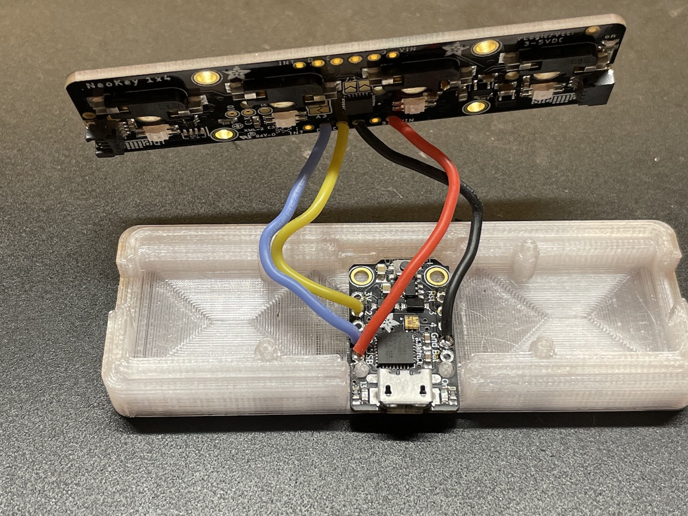

# README

This is a 4-key keyboard I put together using an [Adafruit NeoKey 1x4](https://www.adafruit.com/product/4980) board and a [Trinket M0](https://www.adafruit.com/product/3500).

This is intended to solve a pretty specific problem for me. I have a KVM switch on the desk in my home office that lets me switch between my employer-provided laptop and my personal machine. While I'm working, I like to play music that resides on my personal machine, but since the KVM is switched away from it I can't easily pause or skip songs. This is intented to solve that problem -- I can leave it plugged directly into the machine with the music on it and use it to control playback.

For my specific case, I've got the first three keys configured as media keys:
- Play/pause 
- Skip forward
- Skip backward

and the fourth key configured to send `F15`. On my personal machine, this is configured to invoke Siri, which allows me to use voice commands to switch albums or whatever. I don't have any volume control or mute keys set up, since I'm running through a desktop speaker setup that has a physical volume knob.

Using this as a starting point, it would of course be trivial to reconfigure the keys to anything that's useful to you, or even add some logic for chording, modality or other use cases. Have fun with it!

The LEDs are essentially doing the same thing as the sample code I lifted from the [basic example](https://github.com/adafruit/Adafruit_Seesaw/blob/master/examples/NeoKey_1x4/basic/basic.ino) included with the Adafruit seesaw library, I just tweaked the colors to be more to my liking.

There is one slightly novel thing about the startup code. In the startup() method, there's a loop that waits for the USB device to mount, cycling the LEDs in white while it does. Once the device mounts, it sets them all to green and quickly fades to black. 

If the mount doesn't happen for a full 5 seconds (which will be the case if it's only plugged into power but NOT usb), it instead does a red-to-black fade and goes into the main loop anyway. This is just so that the blinky lights can be easily demoed by plugging into a USB charger if a computer isn't available.

# HARDWARE

I built this around the Trinket M0 because I had one lying around, and I hadn't actually found a good use for it. It's cool and really tiny, but most of the projects I do just need a few more pins. Pairing it with the NeoKey (which uses I2C to communicate) works great, although it does require a little soldering since the Trinket doesn't have a STEMMA QT connector:

The 3D printed case was designed in OpenSCAD, and I've included the [.scad source](case/case.scad) as well as an STL file that contains both the base and the lid. 

I printed the case in clear/natural PETG (because that's my material of choice), using Cura to slice it with 100% infill and the "Concentric" pattern for top/bottom layers (it would function just fine at 25% infill, but with clear filament the infill shows through and looks not-great, and Concentric just makes a cool pattern).

The projection on the back end of the Trinket fits into a small notch in the side of the case, and the mounting holes near the USB connector fit down over pegs that stick up from the base. I've left a 2mm deep space below the solder pads, which should be plenty of room, but if the ends of the wires you soldered on were sticking through more than that you may need to trim the excess.

The NeoKey 1x4 board snaps down onto mounting pegs so that it's over the top of the Trinket. Bend the wires to the sides so they're out of the way as you put it in place.

The top half of the case has projections that stick down and trap both the Trinket and the NeoKey board in place. It's just a friction-fit, but I find that it holds together very well for me.

I've included cutouts in the ends of the case so that you can use the STEMMA QT plugs at either end of the NeoKey board to chain more I2C devices. I haven't done anything with these myself yet (and there's nothing in the code to talk to additional devices), so that's left as an exercise to the reader. ;) 

These cutouts are also useful for getting the case open -- I use a spudger in the cutout to gently pry one end loose, and from there it's easy to separate the top.

From there, just add 4 Cherry MX compatible switches and key caps and plug it in. Enjoy!

